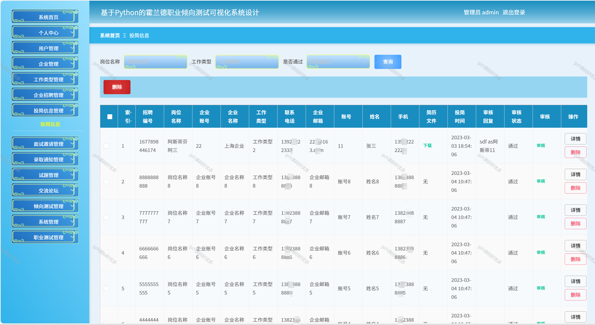

# python070
python070基于Python+Django的职业倾向测试可视化系统+LW+PPT
 
## 查看主页获取源码

### 一、关键词
职业倾向评估可视化系统，职业兴趣测评可视化系统，职业适配性测试可视化系统

### 二、作品包含
源码+数据库+万字设计文档+PPT+全套环境和工具资源+本地部署教程

### 三、项目技术
前端技术：Vue2.0、Element-ui
后端技术：Python3.7、Django2.0

### 四、运行环境（以下版本亲测，其他版本兼容性请自行测试）
开发工具：PyCharm + VSCODE

数据库：MySQL5.7（最低要5.7版本）

数据库管理工具：Navicat10+

Python：Python3.7

前端Nodejs：14

浏览器：谷歌浏览器

### 五、项目介绍
项目编号：python070

系统从三个对象：由管理员和用户、企业来对系统进行设计构建。主要功能包括：个人信息修改，对用户信息、企业信息、企业招聘、投简信息、面试邀请、录取通知、试题、交流论坛、倾向测试等功能进行管理。本系统在一般霍兰德职业倾向测试可视化系统的基础上增加了首页推送最新信息的功能，方便用户快速浏览，是一个高效的、动态的、交互友好的霍兰德职业倾向测试可视化系统。
本系统在设计过程中，很好地发挥了该开发方式的优势，让实现代码有了良好的可读性，而且使代码的更新和维护更加的方便，操作简单，对以后的维护减少了很多麻烦。系统的顺利开发和实现，对于霍兰德职业倾向测试可视化信息这一方面提供巨大的便利服务，无论是管理员还是用户和企业，都带来了极大的便利，方便大众，为社会的进步与发展提供了一些动力。

### 六、运行截图

